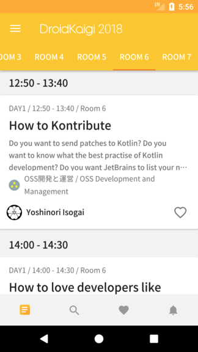
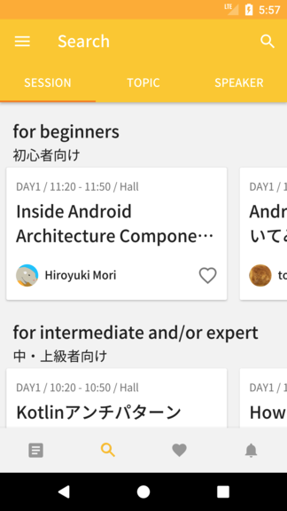
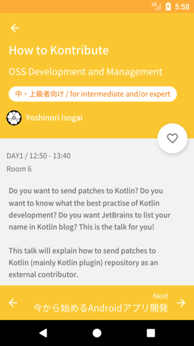

#  DroidKaigi 2018 official Android app
[](https://circleci.com/gh/DroidKaigi/conference-app-2018)[](https://waffle.io/DroidKaigi/conference-app-2018)

[DroidKaigi 2018](https://droidkaigi.jp/2018/en/) is a conference tailored for developers on 8th and 9th February 2018.

[](https://dply.me/xt08ja#install)

# Features
  

* View conference schedule and details of each session
* Set notification for upcoming sessions on your preference
* Search sessions and speakers and topics
* Show Information Feed


# Contributing
We are always welcome your contribution!

## How to find the tasks
We use [waffle.io](https://waffle.io/DroidKaigi/conference-app-2018) to manage the tasks.
Please find the issues you'd like to contribute in it.
[welcome contribute](https://github.com/DroidKaigi/conference-app-2018/labels/welcome%20contribute) and [easy](https://github.com/DroidKaigi/conference-app-2018/labels/easy) are good for first contribution.

Of course, it would be great to send PullRequest which has no issue!

## How to contribute
If you find the tasks you want to contribute, please comment in the issue like [this](https://github.com/DroidKaigi/conference-app-2018/issues/73#issuecomment-357410022) to prevent to conflict contribution.
We'll reply as soon as possible, but it's unnecessary to wait our reaction. It's okay to start contribution and send PullRequest!

We've designated these issues as good candidates for easy contribution. You can always fork the repository and send a pull request (on a branch other than `master`).


# Development Environment

## Kotlin
This app is full Kotlin!

## RxJava2 & LiveData
Converting RxJava2's publisher to AAC LiveData with [LiveDataReactiveStreams](https://developer.android.com/reference/android/arch/lifecycle/LiveDataReactiveStreams.html).

> AllSessionsViewModel.kt

```kotlin
repository.sessions
    .toResult(schedulerProvider)
    .toLiveData()
```

> LiveDataReactiveStreamsExt.kt

```kotlin
fun <T> Publisher<T>.toLiveData() = LiveDataReactiveStreams.fromPublisher(this)
```

## Groupie

By using Groupie you can simplify the implementation around RecyclerView.

```kotlin
data class SpeakerItem(
        val speaker: Speaker
) : BindableItem<ItemSpeakerBinding>(speaker.id.hashCode().toLong()) {

    override fun bind(viewBinding: ItemSpeakerBinding, position: Int) {
        viewBinding.speaker = speaker
    }

    override fun getLayout(): Int = R.layout.item_speaker
}
```

# Architecture
This app uses an Android Architecture Components(AAC) based architecture using AAC(LiveData, ViewModel, Room), Kotlin, RxJava, DataBinding, dependency injection, Firebase.

<image src="https://user-images.githubusercontent.com/1386930/34318268-f8b7eece-e806-11e7-8b18-d9fc64dcd24e.png" width="500" />

## Fragment -> ViewModel

<image src="https://user-images.githubusercontent.com/1386930/34699651-ed4798b4-f521-11e7-84c9-11528a1c1f8c.png" width="500" />

Use `LifecycleObserver` for telling lifecycle to ViewModel.

SessionsFragment.kt

```kotlin
class SessionsFragment : Fragment(), Injectable {

    private lateinit var sessionsViewModel: SessionsViewModel

...
    override fun onViewCreated(view: View, savedInstanceState: Bundle?) {
        super.onViewCreated(view, savedInstanceState)
        ...
        lifecycle.addObserver(sessionsViewModel)
        ...
```

SessionsViewModel.kt

```kotlin
class SessionsViewModel @Inject constructor(
        private val repository: SessionRepository,
        private val schedulerProvider: SchedulerProvider
) : ViewModel(), LifecycleObserver {
  ...
    @OnLifecycleEvent(Lifecycle.Event.ON_CREATE)
    fun onCreate() {
    ...
}
```

## ViewModel -> Repository
<image src="https://user-images.githubusercontent.com/1386930/34699666-0360c026-f522-11e7-935e-663006e72d01.png" width="500" />

Use RxJava2(RxKotlin) and `ViewModel#onCleared()` for preventing leaking.

SessionsViewModel.kt

```kotlin
    private val compositeDisposable: CompositeDisposable = CompositeDisposable()

    @OnLifecycleEvent(Lifecycle.Event.ON_CREATE)
    fun onCreate() {
        repository
                .refreshSessions()
                .subscribeBy(onError = defaultErrorHandler())
                .addTo(compositeDisposable)
    }

    override fun onCleared() {
        super.onCleared()
        compositeDisposable.clear()
    }
```

## Repository -> API, Repository -> DB

<image src="https://user-images.githubusercontent.com/1386930/34699678-156f4f3a-f522-11e7-92a7-bebf96a9ed4b.png" width="500" />

Use Retrofit and save to the `Architecture Component Room`.

SessionDataRepository.kt

```kotlin
    override fun refreshSessions(): Completable {
        return api.getSessions()
                .doOnSuccess { response ->
                    sessionDatabase.save(response)
                }
                .subscribeOn(schedulerProvider.computation())
                .toCompletable()
    }
```

## DB -> Repository

<image src="https://user-images.githubusercontent.com/1386930/34699688-1eccee0c-f522-11e7-9c2c-77870cccca5b.png" width="500" />

Use `Room` with RxJava2 Flowable Support.
And SessionDataRepository holds Flowable property.

SessionDao.kt

```kotlin
    @Query("SELECT room_id, room_name FROM session GROUP BY room_id ORDER BY room_id")
    abstract fun getAllRoom(): Flowable<List<RoomEntity>>
```

SessionDataRepository.kt

```kotlin
class SessionDataRepository @Inject constructor(
        private val sessionDatabase: SessionDatabase,
...
) : SessionRepository {

    override val rooms: Flowable<List<Room>> =
            sessionDatabase.getAllRoom().toRooms()
```

## Repository -> ViewModel

<image src="https://user-images.githubusercontent.com/1386930/34699694-29ddfdcc-f522-11e7-83df-aa872eebafbb.png" width="500" />

We create LiveData from a ReactiveStreams publisher with [LiveDataReactiveStreams](https://developer.android.com/reference/android/arch/lifecycle/LiveDataReactiveStreams.html)


SessionsViewModel.kt

```kotlin
    val rooms: LiveData<Result<List<Room>>> by lazy {
        repository.rooms
                .toResult(schedulerProvider)
                .toLiveData()
    }
```

LiveDataReactiveStreamsExt.kt

```kotlin
fun <T> Publisher<T>.toLiveData() = LiveDataReactiveStreams.fromPublisher(this) as LiveData<T>
```

And using `Result` class for error handling with Kotlin extension.

```kotlin
fun <T> Flowable<T>.toResult(schedulerProvider: SchedulerProvider): Flowable<Result<T>> =
        compose { item ->
            item
                    .map { Result.success(it) }
                    .onErrorReturn { e -> Result.failure(e.message ?: "unknown", e) }
                    .observeOn(schedulerProvider.ui())
                    .startWith(Result.inProgress())
        }
```

```kotlin
sealed class Result<T>(val inProgress: Boolean) {
    class InProgress<T> : Result<T>(true)
    data class Success<T>(var data: T) : Result<T>(false)
    data class Failure<T>(val errorMessage: String?, val e: Throwable) : Result<T>(false)

```

## ViewModel -> Fragment

<image src="https://user-images.githubusercontent.com/1386930/34699699-320f9bb8-f522-11e7-9ce3-f02940f1343e.png" width="500" />

Fragment observe ViewModel's LiveData.
We can use the result with Kotlin `when` expression.
In `is Result.Success` block, you can access data with `result.data` by Kotlin Smart cast.

SessionsFragment.kt

```kotlin
        sessionsViewModel.rooms.observe(this, { result ->
            when (result) {
                is Result.InProgress -> {
                    binding.progress.show()
                }
                is Result.Success -> {
                    binding.progress.hide()
                    sessionsViewPagerAdapter.setRooms(result.data)
                }
                is Result.Failure -> {
                    Timber.e(result.e)
                    binding.progress.hide()
                }
            }
        })
```

## Release
The release process is automated by using [gradle-play-publisher](https://github.com/Triple-T/gradle-play-publisher).
When we add `git tag`, CI deploys the release apk to GooglePlay alpha. 
To know more details, see [.circleci/config.yml](https://github.com/DroidKaigi/conference-app-2018/blob/master/.circleci/config.yml)

```shell
elif [[ "${CIRCLE_TAG}" =~ ^v[0-9]+\.[0-9]+\.[0-9]+$ ]]; then
    echo "Deploy to Google Play"
    openssl aes-256-cbc -k $PUBLISHER_KEYS_JSON_DECRYPT_PASSWORD -d -in encrypted-publisher-keys.json -out app/publisher-keys.json
    ./gradlew publishApkRelease
fi
```

## iOS App with Kotlin/Native and Kotlin Multiplatform Projects
Some contributors are challenging to develop iOS app with [Kotlin/Native](https://kotlinlang.org/docs/reference/native-overview.html) and [Kotlin Multiplatform Projects](https://kotlinlang.org/docs/reference/multiplatform.html).  
We are watching this project. 
[DroidKaigi2018iOS](https://github.com/kikuchy/DroidKaigi2018iOS)

## DroidKaigi 2018 Flutter App
The unofficial conference app for DroidKaigi 2018 Tokyo
https://github.com/konifar/droidkaigi2018-flutter

## Thanks
Thank you for contributing!

* Contributors
  * [GitHub : Contributors](https://github.com/DroidKaigi/conference-app-2018/graphs/contributors)
* Designer  
  * [okapi / Yuki Okamoto](https://www.instagram.com/okamoto.yuki/)
  * [DroidKaigi 2018 Zeplin Scene](https://scene.zeplin.io/project/5a327a64f0b20176887c556c)

## Credit
This project uses some modern Android libraries and source codes.

* Android Architecture Components
  * [Lifecycles](https://developer.android.com/topic/libraries/architecture/lifecycle.html)
  * [LiveData](https://developer.android.com/topic/libraries/architecture/livedata.html)
  * [ViewModel](https://developer.android.com/topic/libraries/architecture/viewmodel.html)
  * [Room](https://developer.android.com/topic/libraries/architecture/room.html)
  * [ReactiveStreams](https://developer.android.com/reference/android/arch/lifecycle/LiveDataReactiveStreams.html)
* Android Support Libraries
  * Support v4
  * AppCompat v7
  * Design
  * VectorDrawable
  * CardView
  * ConstraintLayout
  * RecyclerView
  * AOSP Codes
* Firebase
  * [Cloud Firestore](https://firebase.google.com/docs/firestore/)
  * [Auth](https://firebase.google.com/docs/auth/)
* [KTX](https://github.com/android/android-ktx/), [Dagger2](https://google.github.io/dagger/), Dagger Android Support, [Glide4](https://bumptech.github.io/glide/) - Google
* [Kotlin](http://kotlinlang.org/) - JetBrains
* [Retrofit2](http://square.github.io/retrofit/), [Moshi](https://github.com/square/moshi/) - Square
* [RxJava2](https://github.com/ReactiveX/RxJava), [RxKotlin](https://github.com/ReactiveX/RxKotlin), RxAndroid  - ReactiveX
* [OkHttp3](http://square.github.io/okhttp/)
* [ThreeTenABP](https://github.com/JakeWharton/ThreeTenABP), [Timber](https://github.com/JakeWharton/timber) - JakeWharton
* [Groupie](https://github.com/lisawray/groupie) - lisawray
* [Stetho](http://facebook.github.io/stetho/) - Facebook
* [Kotshi](https://github.com/ansman/kotshi) - ansman
* [DownloadableCalligraphy](https://github.com/takahirom/DownloadableCalligraphy) - takahirom
* [Kotpref](https://github.com/chibatching/Kotpref) - chibatching
* [RxBroadcast](https://github.com/cantrowitz/RxBroadcast) - cantrowitz
* [ProgressTimeLatch](https://github.com/chrisbanes/tivi/blob/96e7cae7560ffd358b8c58c47267ed1024df53f6/app/src/main/java/me/banes/chris/tivi/ui/ProgressTimeLatch.kt) - chrisbanes
* [Google I/O 2017](https://github.com/google/iosched)
* [DebouncingOnClickListener](https://github.com/JakeWharton/butterknife/blob/e78507711fe8a7c637ee61c44a7b09f1be8ff9f6/butterknife/src/main/java/butterknife/internal/DebouncingOnClickListener.java) - JakeWharton

## License

    Copyright 2018 DroidKaigi

    Licensed under the Apache License, Version 2.0 (the "License");
    you may not use this file except in compliance with the License.
    You may obtain a copy of the License at

       http://www.apache.org/licenses/LICENSE-2.0

    Unless required by applicable law or agreed to in writing, software
    distributed under the License is distributed on an "AS IS" BASIS,
    WITHOUT WARRANTIES OR CONDITIONS OF ANY KIND, either express or implied.
    See the License for the specific language governing permissions and
    limitations under the License.
